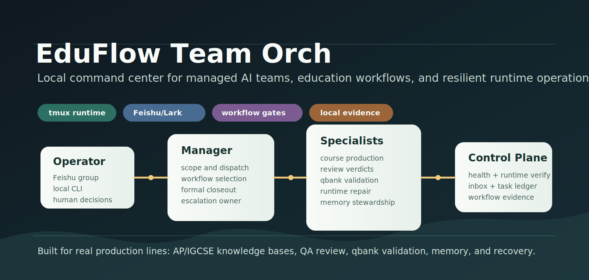
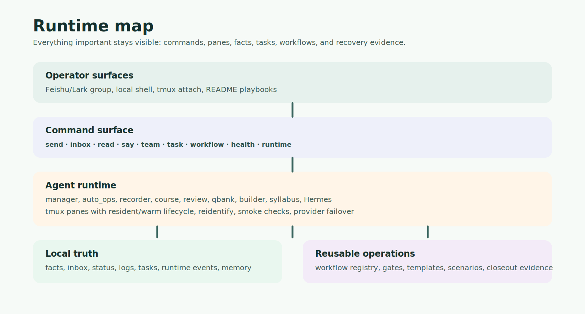
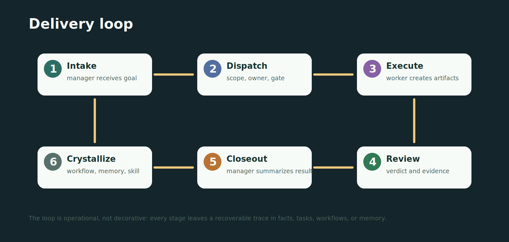

# EduFlow Team Orch

<p align="center">
  
</p>

**EduFlow Team Orch** is a local multi-agent orchestration system for real production work. 它把 Claude Code、Codex CLI、Kimi、Qwen、Gemini、Qoder CN、Hermes 等 CLI agents 放进一个可观测、可重启、可审计的团队运行时里，让 `manager` 统一接单、拆单、派工、回收和 closeout。

This is not a chatbot demo. 这个项目已经具备完整的 operating surface：tmux agent residency、Feishu/Lark group control、本地 inbox 与 task ledger、runtime failover、workflow registry、durable memory、warm standby、health checks，以及面向教育内容生产的 workflow playbooks。

## Product Positioning / 项目定位

EduFlow Team Orch solves a very practical problem: when AI agents are used for long-running education production, QA review, qbank validation, runtime repair, and institutional memory, they need team discipline, not just bigger prompts.

它提供的不是“更多 agent”，而是清晰组织结构：

- The user talks to `manager` first. 用户只对 `manager` 下达目标。
- `manager` owns routing, scope, workflow choice, escalation, and formal closeout.
- Workers execute bounded slices only. worker 只做自己的任务切片。
- Reviewers issue evidence-based verdicts. reviewer 必须给出文件证据驱动的 formal verdict。
- `auto_ops` watches runtime and process anomalies, not business conclusions.
- Important state is written to local facts, tasks, workflow evidence, memory, or runtime events.

The result: long tasks stay recoverable across context loss, provider switching, stale status, pane crashes, and repeated production cycles.

## Completed Capabilities / 已完成能力

| Area / 模块 | Current Capability / 已完成内容 |
| --- | --- |
| Team runtime / 团队运行时 | `up`, `down`, `hire`, `fire`, `reidentify`, `compact`, `reset`, `switch`, tmux pane provisioning |
| Runtime trust / 运行可信度 | `health`, `runtime verify`, runtime events, live env checks, API smoke, stale-status guardrails |
| Warm residency / 温备驻留 | resident/warm policy, `residency-sleep`, `residency-wake`, pending-task protection |
| Messaging / 消息系统 | `send`, `inbox`, `read`, `say`, Feishu/Lark router, visible card protocol |
| Task ledger / 任务台账 | dispatch, status, review queue, manager panel, publish gate, anomaly scan |
| Workflow registry / 工作流注册表 | active workflows, candidates, promotion, triggers, roles, checklists, handoff templates, strict validation |
| Durable memory / 长期记忆 | remember/recall/forget, memory candidates, Obsidian export, reusable lessons |
| Education production / 教育生产 | IGCSE subject launch, item-level prototype, 9-subject sprint, AP knowledge-base optimization |
| Ops recovery / 运维恢复 | watchdog, runtime guard, provider failover, CLI shim, Feishu bot setup, deployment docs |

## Runtime Architecture / 运行架构

<p align="center">
  
</p>

EduFlow is organized as five layers:

1. **Operator surfaces / 操作入口**：Feishu/Lark group、本地 shell、tmux attach、README/文档。
2. **Command surface / 命令面**：`send`、`inbox`、`read`、`say`、`team`、`task`、`workflow`、`health`、`runtime`。
3. **Agent runtime / Agent 运行层**：manager、auto_ops、recorder、course、review、qbank、builder、syllabus、Hermes。
4. **Local truth / 本地事实层**：facts、inbox、status、logs、tasks、runtime events、memory。
5. **Reusable operations / 复用资产层**：workflow registry、gates、templates、scenarios、closeout evidence。

This structure makes the important questions inspectable: Is the runtime healthy? Was the task really delivered? Did a worker cross role boundaries? Does review have file evidence? Is the status stale?

## Team Shape / 当前团队形态

The production roster in this checkout is centered on 9 core agents:

| Agent | Residency / 驻留 | Responsibility / 职责 |
| --- | --- | --- |
| `manager` | resident / 常驻 | business entry, dispatch, escalation, formal closeout |
| `auto_ops` | resident / 常驻 | internal patrol, anomaly detection, cadence tracking |
| `Luke_recorder` | resident / 常驻 | records decisions, corrections, and reusable lessons |
| `worker_course` | warm / 温备 | course assets, topic structure, syllabus alignment, base content |
| `review_course` | warm / 温备 | formal review, verdicts, quality gates |
| `worker_builder` | warm / 温备 | platform repair, workflow assets, runtime hardening |
| `worker_qbank` | warm / 温备 | QA schema, manifest, qbank validation, import readiness |
| `worker_syllabus` | warm / 温备 | syllabus skill generation and structured syllabus analysis |
| `Hermes` | warm / 温备 | knowledge stewardship, Recall/Distill, Wiki proposals, memory backlog |

Resident agents stay online. Warm agents keep their tmux pane but may release the CLI when idle. 下一次派工或 preheat 会自动唤醒；`已接单`、`待接单`、`已读待确认`、`进行中` 不会被 warm sleep 误关。

## Delivery Loop / 交付闭环

<p align="center">
  
</p>

The useful unit of work is not a single prompt. EduFlow treats work as a recoverable delivery loop:

1. **Intake / 接单**：manager receives the goal and decides owner, workflow, and boundary.
2. **Dispatch / 派工**：task and inbox state define the slice and acceptance gate.
3. **Execute / 执行**：worker produces artifacts with progress evidence.
4. **Review / 复核**：reviewer checks files, schema, manifest, paths, and role boundaries.
5. **Closeout / 收口**：manager summarizes result, risk, evidence, and next action.
6. **Crystallize / 沉淀**：repeated patterns become workflow gates, memory, or skills.

This loop is the core value of the repo: one execution becomes something reviewable, repairable, and reusable.

## Repository Map / 仓库结构

```text
src/eduflow/
  agents/       CLI adapters, identity rendering, spawn contracts
  commands/     eduflow command surface
  feishu/       Feishu/Lark messages, cards, slash handling, routing
  memory/       durable memory, candidates, retrieval, export
  runtime/      tmux, lifecycle, failover, residency, health checks
  store/        inbox, local facts, tasks, publish gates, evidence

docs/
  workflows/    callable workflow registry and candidate promotion flow
  templates/    IGCSE / QA / topic production templates
  media/        README and documentation visuals
  plans/        design notes and runtime audits

scripts/
  eduflowteam   checkout-local CLI shim
  qbank_verify.py, ap_qbank_verify.py
                qbank and AP asset validation utilities

tests/
  unit/         command, runtime, store, workflow, memory tests
  integration/ in-process flow checks
  scenarios/   manual smoke and operator playbooks
```

## Installation / 安装启动

Use the repo shim for local work. 建议始终使用仓库内的 `./scripts/eduflowteam`，避免全局 `eduflow` 指向旧 checkout。

```bash
python3 -m venv .venv
source .venv/bin/activate
pip install -e .

./scripts/eduflowteam --help
```

Initialize a team:

```bash
./scripts/eduflowteam init
$EDITOR eduflow.toml
./scripts/eduflowteam install-hooks
./scripts/eduflowteam up
./scripts/eduflowteam health
```

External requirements depend on deployment:

- `tmux`
- selected CLI agents: Claude Code, Codex CLI, Kimi, Qwen, Gemini, Qoder CN, Hermes
- Feishu/Lark app credentials and `chat_id` if group control is enabled
- provider tokens referenced by `eduflow.toml` env profiles

## Daily Operations / 日常操作

```bash
# Runtime
./scripts/eduflowteam up
./scripts/eduflowteam health
./scripts/eduflowteam team
./scripts/eduflowteam team --current

# Agent lifecycle
./scripts/eduflowteam hire worker_qbank
./scripts/eduflowteam fire worker_qbank
./scripts/eduflowteam reidentify worker_qbank
./scripts/eduflowteam runtime verify worker_qbank

# Messaging
./scripts/eduflowteam send manager user "请检查当前任务状态并给出下一步"
./scripts/eduflowteam inbox manager
./scripts/eduflowteam read manager
./scripts/eduflowteam say manager "已收到，开始处理" --to user

# Warm residency
./scripts/eduflowteam residency-sleep --json
./scripts/eduflowteam residency-wake worker_course --json

# Workflows
./scripts/eduflowteam workflow list
./scripts/eduflowteam workflow use igcse-subject-launch
./scripts/eduflowteam workflow validate --strict
```

## Active Workflow Registry / 活跃工作流

The active registry lives in [docs/workflows](docs/workflows/README.md).

| Workflow | Use Case / 使用场景 |
| --- | --- |
| `igcse-subject-launch` | launch or pre-QA gate for an IGCSE subject |
| `igcse-item-level-prototype` | verify topic-level QA can become item-level qbank assets |
| `igcse-9subject-sprint` | coordinate multi-subject IGCSE sprint work |
| `ap-knowledge-base-optimization` | produce and review AP knowledge-base and item assets |
| `realrun-to-workflow` | turn a real execution pattern into reusable workflow assets |
| `runtime-failover-hardening` | repair and verify cross-provider runtime recovery |

Workflow is not an automatic engine. 它是 manager 派工、worker 边界、review gate、forbidden moves 和 closeout evidence 的共同契约。

## Runtime Trust / 运行可信度

EduFlow does not treat "pane is alive" as enough. 一个 agent 真正健康，需要同时证明：

- tmux pane exists and runs the expected CLI;
- live env matches the declared runtime profile;
- provider smoke check passes when applicable;
- inbox is not silently stuck;
- status/facts are not polluted by flag-shaped pseudo-agents;
- warm-residency sleep will not retire accepted or pending work.

Common checks:

```bash
./scripts/eduflowteam health
./scripts/eduflowteam runtime list
./scripts/eduflowteam runtime verify manager --json
./scripts/eduflowteam runtime events --last 20
```

## Key Docs / 重要文档

| Document | Purpose / 用途 |
| --- | --- |
| [docs/DEPLOYMENT.md](docs/DEPLOYMENT.md) | deployment and runtime guide |
| [docs/setup_feishu_bot.md](docs/setup_feishu_bot.md) | Feishu/Lark bot setup |
| [docs/workflows/README.md](docs/workflows/README.md) | workflow registry entrypoint |
| [docs/EDUFLOW_12_AGENT_BLUEPRINT.md](docs/EDUFLOW_12_AGENT_BLUEPRINT.md) | expanded team blueprint |
| [docs/EDUFLOW_GROWTH_PLAN.md](docs/EDUFLOW_GROWTH_PLAN.md) | growth and capability roadmap |
| [docs/team-rules.md](docs/team-rules.md) | collaboration rules |
| [CLAUDE.md](CLAUDE.md) | development and agent-side conventions |

## Development / 开发验证

```bash
PYTHONPATH=src python3 -m eduflow.cli --help
pytest -q
```

When changing runtime behavior, prefer tests that prove the operator surface: command output, health verdicts, status rows, runtime events, and task evidence.

常用窄测：

```bash
pytest -q tests/unit/test_commands_health.py
pytest -q tests/unit/test_runtime_lifecycle.py
pytest -q tests/unit/test_commands_team_workspace.py
pytest -q tests/unit/test_residency_sleep.py
```

## License

[MIT](LICENSE)
