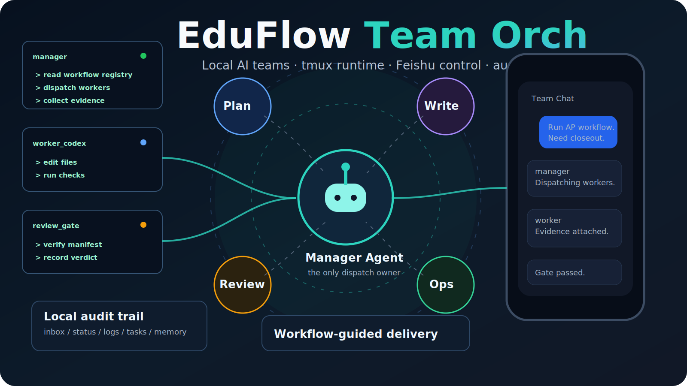
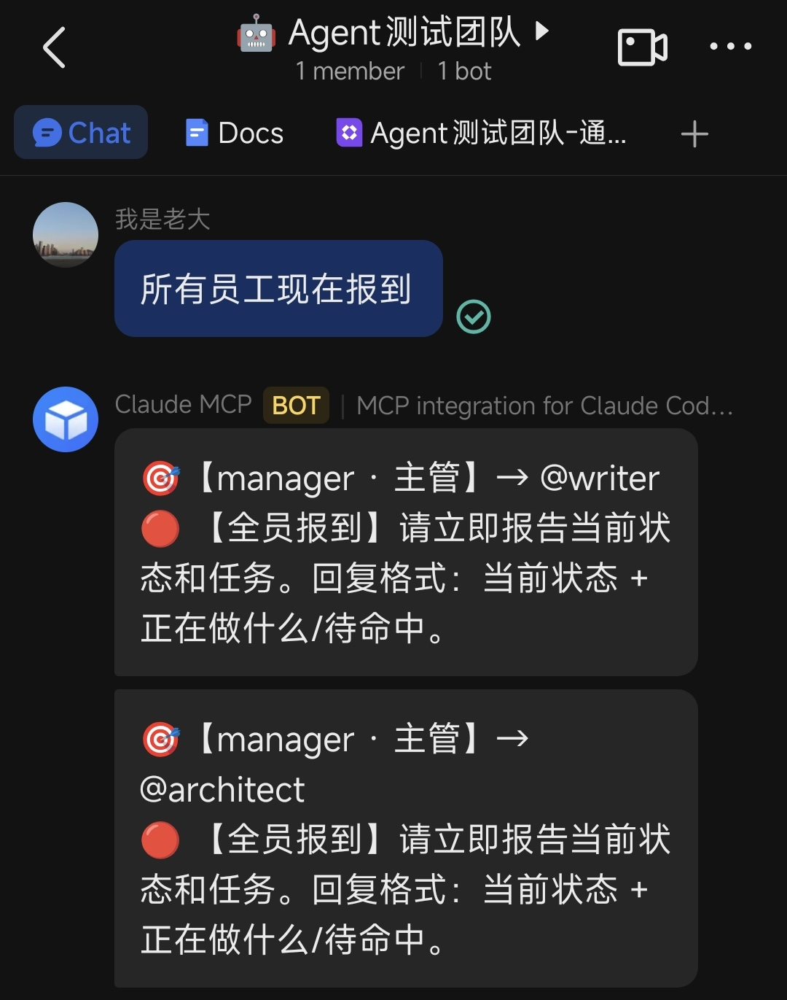
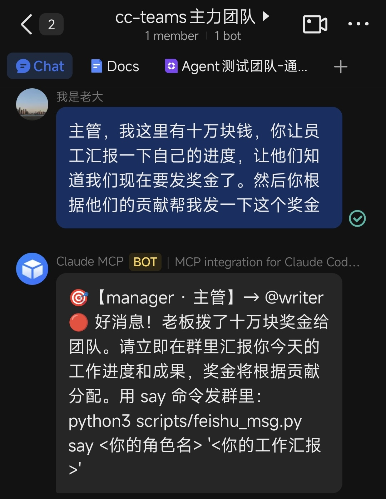
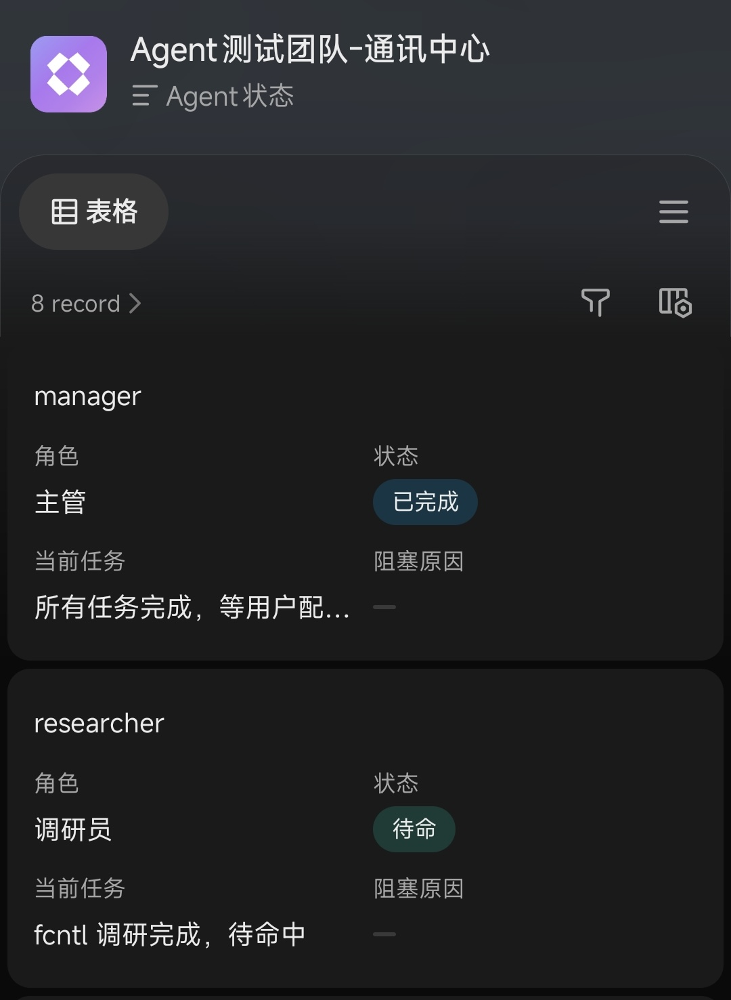
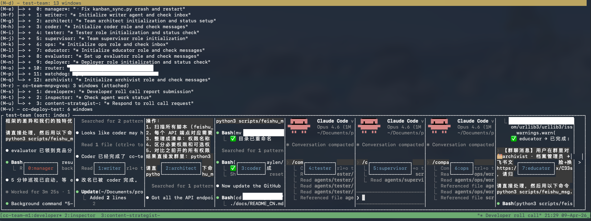
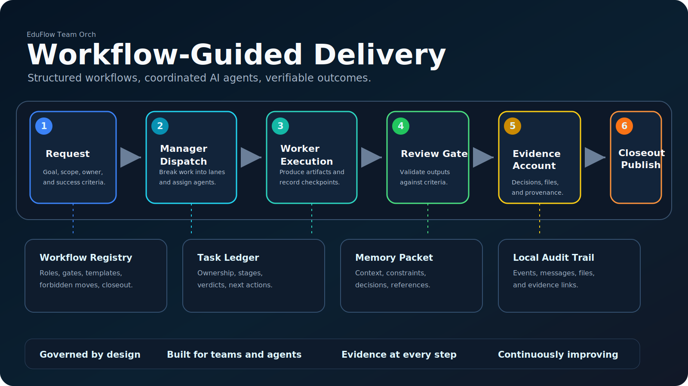
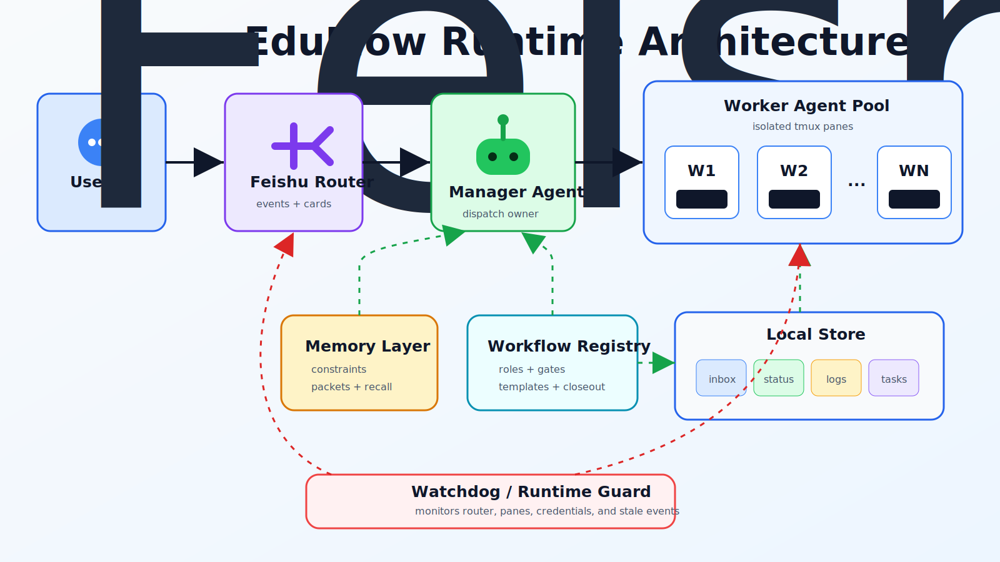

# EduFlow Team Orch

<p align="center">
  
</p>

<p align="center">
  <a href="LICENSE"></a>
  
  
  
</p>

EduFlow Team Orch 是一个面向真实生产任务的多智能体团队编排项目。它把 Claude Code、Codex CLI、Gemini CLI、Kimi、Qwen、Qoder CN 等命令行 Agent 放进独立的 tmux pane，由统一的 manager 角色调度，再通过飞书群、任务台账、工作流 registry 和本地持久记忆把过程沉淀下来。

这个仓库不是一个“聊天机器人 demo”。它更像一套本地可审计的 AI 团队操作系统：老板只需要在飞书群或 CLI 里下达目标，manager 负责任务拆分、派发、回收、复盘和关口检查；worker 只处理自己的任务切片；runtime 负责拉起、唤醒、重启、切换和记录证据。

## 适合什么场景

- 长链路教育内容生产：A-Level、IGCSE、AP 等课程知识库、题库、讲义、质检与发布。
- 多 Agent 协作开发：一个 manager 同时驱动多个 coding CLI，保持任务、状态和证据可追踪。
- 需要手机端遥控的本地团队：飞书群里 `/health`、`/send`、`/peek`、`/team` 就能看状态和派活。
- 需要运行时韧性的任务线：watchdog、runtime guard、reidentify、memory packet、failover 让 pane 崩溃或上下文清空后还能恢复。
- 需要把一次真实执行沉淀成复用流程的团队：`docs/workflows/` 提供工作流注册、候选、验证和晋升机制。

不适合：只想要一个无状态网页聊天 UI、纯云端托管服务，或不愿配置本地 CLI / 飞书应用的使用者。

## 核心能力

### 多 CLI Agent 编排

每个 agent 是一个独立身份、独立 pane、独立任务队列。团队配置在 `eduflow.toml` 中声明，manager 可以派发给不同 CLI 的 worker。

| CLI adapter | 常用标识 | 说明 |
| --- | --- | --- |
| Claude Code | `claude-code` | 默认 manager / worker 适配器 |
| Codex CLI | `codex-cli` | OpenAI Codex CLI worker |
| Gemini CLI | `gemini-cli` | Google Gemini CLI worker |
| Kimi Code | `kimi-code`, `kimi-cli` | Kimi worker |
| Qwen Code | `qwen-code`, `qwen-cli` | Qwen worker |
| Qoder CN | `qoder-cli-cn`, `qoderclicn` | 国内 Qoder CLI worker |
| Hermes | `hermes-agent`, `hermes-cli` | 外部监督 / steward 类角色 |

### 飞书群控制面

EduFlow 可以把飞书群作为团队控制台。老板只对 manager 说话，manager 再把任务路由给 worker。群里可以看到阶段性回报、报警卡片、健康检查和关键证据。

<table>
  <tr>
    <td></td>
    <td></td>
    <td></td>
    <td></td>
  </tr>
</table>

### tmux 运行时

Agent 进程运行在 tmux 里，方便本地观测、恢复和手工介入。`eduflow up` 会拉起团队、router 和 watchdog；`eduflow down` 会关闭运行时但保留状态。

<p>
  
</p>

### 本地台账、记忆和工作流

EduFlow 的状态优先落在本地文件和 SQLite，而不是远程数据库。任务台账、inbox、日志、memory、workflow gate、publish evidence 都能在仓库或状态目录里追溯。

`docs/workflows/` 是项目的“可调用流程库”，例如：

- `igcse-subject-launch`
- `igcse-item-level-prototype`
- `igcse-9subject-sprint`
- `ap-knowledge-base-optimization`
- `runtime-failover-hardening`
- `realrun-to-workflow`

这些 workflow 不是自动执行引擎，而是 manager 派单、worker 执行、review 关口和 closeout 证据的共同契约。

<p align="center">
  
</p>

## 架构概览

<p align="center">
  
</p>

典型链路：

1. 用户在飞书群、CLI 或任务台账里给 manager 一个目标。
2. manager 根据 `identity.md`、工作流 registry 和当前任务状态拆解任务。
3. router 把消息写入目标 agent inbox，并按 publish 规则决定是否发群卡片。
4. worker 在自己的 tmux pane 中执行，完成后通过 `say` / `send` 回报。
5. watchdog、runtime guard 和 health 命令持续检查进程、凭证、router 和 pane 状态。
6. memory / task / workflow evidence 把复用规则和执行证据沉淀下来。

## 快速开始

### 1. 克隆并安装

```bash
git clone https://github.com/Harryanhuang/EduFlow-Team-orch.git
cd EduFlow-Team-orch

python3 -m venv .venv
source .venv/bin/activate
pip install -e .
```

本地开发时也可以直接用仓库里的 shim，避免全局 `eduflow` 指向旧 checkout：

```bash
./scripts/eduflowteam --help
```

### 2. 设置状态目录

```bash
export EDUFLOW_STATE_DIR="$PWD/state"
export LARK_CLI_NO_PROXY=1
export EDUFLOW_LARK_SEND_AS=bot
```

建议把这些环境变量写入你的 shell profile，或写进团队专用启动脚本。

### 3. 初始化配置

```bash
eduflow init
$EDITOR eduflow.toml
```

至少需要填：

- `chat_id`: 飞书群 `chat_id`。
- `team.session`: tmux session 名。
- `[team.agents.<name>]`: manager 和 worker 的 CLI、模型、角色。
- `FEISHU_APP_ID` / `FEISHU_APP_SECRET`: 按部署方式写入环境变量、`.env` 或 lark profile。

`eduflow init` 默认生成 manager、`worker_cc`、`worker_codex` 三个角色，可以先保留做 smoke test，再逐步扩展。

### 4. 配置飞书机器人

如果还没有飞书自建应用，优先看：

- [docs/DEPLOYMENT.md](docs/DEPLOYMENT.md): 端到端部署主文档。
- [docs/setup_feishu_bot.md](docs/setup_feishu_bot.md): 飞书 bot 手动/自动配置步骤。
- [docs/setup_feishu_bots_guide.pdf](docs/setup_feishu_bots_guide.pdf): 截图版操作指南。

项目内置 Playwright 辅助脚本，可以用 drive 模式分阶段创建和配置 bot：

```bash
cd scripts/feishu_bot_creator
npm install
node create_feishu_bot.js drive my-eduflow-bot "EduFlow Team Bot" \
  > /tmp/eduflow-feishu-drive.log 2>&1 &
```

每个阶段完成后按脚本状态写入 `next`、`skip`、`redo <stage>` 或 `quit`。具体阶段和失败恢复请看 [docs/setup_feishu_bot.md](docs/setup_feishu_bot.md)。

### 5. 启动团队

```bash
eduflow install-hooks
eduflow up
eduflow health
```

飞书群里可以发送：

```text
/health
/team
@manager 帮我检查当前任务台账，给出下一步派发建议
```

如果不用飞书，也可以先用本地命令验证 store 和任务流：

```bash
eduflow team
eduflow status
eduflow send manager user "请读取 identity 并报告当前状态"
eduflow inbox manager
eduflow read manager
```

## 常用命令

```bash
# 基础
eduflow init
eduflow version
eduflow health
eduflow usage

# 团队生命周期
eduflow up
eduflow down
eduflow reset
eduflow hire <agent>
eduflow fire <agent>
eduflow reidentify <agent>
eval "$(eduflow switch /path/to/team-dir)"

# 消息与状态
eduflow send <to> <from> "message"
eduflow say <agent> "message" --to user
eduflow inbox <agent>
eduflow read <agent>
eduflow status
eduflow log <agent>
eduflow peek <agent>

# 任务、工作流、记忆
eduflow task list
eduflow task dispatch <assignee> "title" --stage <stage> --owner <owner>
eduflow workflow list
eduflow memory search "query"
eduflow remember <agent> note "memory"
eduflow recall <agent>

# 运行时监督
eduflow runtime
eduflow runtime-guard
eduflow watchdog
```

Workflow 推荐使用仓库 shim：

```bash
./scripts/eduflowteam workflow list
./scripts/eduflowteam workflow recommend "launch AP Chemistry knowledge base optimization"
./scripts/eduflowteam workflow use ap-knowledge-base-optimization
./scripts/eduflowteam workflow validate --strict
```

## 典型配置片段

```toml
chat_id = "oc_xxx"
default_model = "opus"

[team]
session = "EduFlow"

[team.agents.manager]
cli = "claude-code"
model = "opus"
role = "团队主管"
card_color = "blue"

[team.agents.worker_codex]
cli = "codex-cli"
model = "gpt-5.4"
role = "代码执行员工"
card_color = "purple"

[team.agents.worker_qoder]
cli = "qoder-cli-cn"
role = "国内 CLI 执行员工"
card_color = "green"

[chat.publish]
user_to_manager = "always"
manager_to_user = "always"
manager_to_worker = true
worker_to_manager = true
worker_to_user = true
worker_to_worker = false
```

## 目录结构

```text
src/eduflow/
  agents/       CLI adapter、identity、agent 启动约定
  commands/     eduflow 子命令
  feishu/       飞书消息、卡片、订阅、slash command
  memory/       本地记忆、约束、检索、注入、导出
  runtime/      tmux、watchdog、lifecycle、failover、health
  store/        task、publish gate、evidence、local facts

docs/
  workflows/    可调用 workflow registry
  templates/    题库 / QA / manifest 模板
  media/        README 和文档图片

scripts/
  eduflowteam   指向当前 checkout 的 CLI shim
  feishu_bot_creator/
                飞书应用自动化配置脚本

tests/
  unit/         单元测试
  integration/ 轻量集成测试
  scenarios/   人工 smoke / 操作场景
```

## 开发与验证

```bash
python3 -m venv .venv
source .venv/bin/activate
pip install -e .

PYTHONPATH=src python3 -m eduflow.cli --help
PYTHONPATH=src pytest
```

只改文档时，至少确认 README 中的本地链接存在；改 runtime、router、memory、workflow 或 task 时，优先补对应测试，再跑相关 `tests/unit/test_*`。

## 重要文档

| 文档 | 用途 |
| --- | --- |
| [docs/DEPLOYMENT.md](docs/DEPLOYMENT.md) | 主部署指南：host、Docker、飞书、常见故障 |
| [docs/setup_feishu_bot.md](docs/setup_feishu_bot.md) | 飞书自建应用配置 |
| [docs/workflows/README.md](docs/workflows/README.md) | workflow registry 入口 |
| [docs/EDUFLOW_GROWTH_PLAN.md](docs/EDUFLOW_GROWTH_PLAN.md) | 团队扩展路线 |
| [docs/EDUFLOW_12_AGENT_BLUEPRINT.md](docs/EDUFLOW_12_AGENT_BLUEPRINT.md) | 12 agent 结构蓝图 |
| [docs/eduflow-team-12-agent.example.toml](docs/eduflow-team-12-agent.example.toml) | 多 agent 配置样例 |
| [docs/team-rules.md](docs/team-rules.md) | 团队协作规则 |
| [CLAUDE.md](CLAUDE.md) | 代码修改约定 |

## 常见问题

**可以不接飞书吗？**  
可以先只用本地 CLI 跑 `send`、`inbox`、`read`、`task`、`workflow` 等命令。但完整的移动端控制、群卡片和 slash command 需要飞书。

**为什么不用远程数据库？**  
这个项目偏本地操盘和可审计恢复。任务、日志、inbox、memory、workflow evidence 都优先落本地，方便排障、迁移和人工接管。

**worker 崩了会不会丢任务？**  
不会直接丢。pane 可以重启，inbox、task、status、memory 仍在本地。通常用 `eduflow health` 定位，再用 `eduflow reidentify <agent>` 或 runtime guard 恢复。

**workflow 会自动执行吗？**  
不会。workflow 是 manager 和各角色之间的执行契约，提供触发文本、角色边界、gate、closeout checklist 和 forbidden moves。真正派发仍由 manager 或操作者显式完成。

**支持多少个 agent？**  
取决于机器内存、CLI 资源和任务类型。建议先从 manager + 2 个 worker 做 smoke test，再按实际吞吐扩展。

## License

[MIT](LICENSE)
