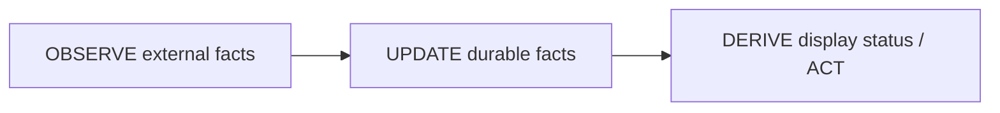
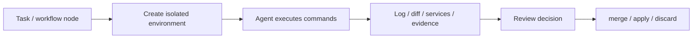

# claude-squad / agent-orchestrator / container-use 对 EduFlow 公司智能体员工系统的差距报告

## 结论先行

这版报告采用修订后的定位：EduFlow 不应该被定义为“教育智能体团队”。更准确的北极星是：**公司智能体员工操作系统**。它让公司把不同 AI 员工放在不同岗位上，每个员工可以绑定不同 CLI 底座、不同模型特长、不同工具权限、不同 workflow 快速通道，从而把真实公司工作效率成倍放大。

这里需要把本地 workflow 功能产品化：它不是普通 SOP，也不是一次性的项目计划，而是重复工作项目组沉淀出来的**可调用协作高速公路**。一次真实工作跑顺后，可以通过 `realrun-to-workflow`、候选验证、manager closeout 和 promotion 机制，沉淀成后续 manager 可直接调用的固定协作路线。

教育业务不是 EduFlow 的边界，而是第一个高密度落地样板。`worker_course`、`review_course`、`worker_qbank` 只是“公司岗位”的一组早期实例，不是产品最终形态。最终形态应该可以扩展到市场、销售、投研、运营、客服、招聘、财务、知识库、工程、内容、课程等多部门岗位。

所以对 `claude-squad`、`agent-orchestrator` 和 `container-use` 的判断也要重写：它们不是 EduFlow 的终局形态，而是三个局部参考。

`claude-squad` 是轻量级本地多 agent 会话管理器。它最强的是一个终端窗口内管理多个 session，每个任务独立 git worktree，能看 diff，能 pause/resume，能把分支 checkout / commit / push 这类工程动作压成很短的操作路径。它适合 EduFlow 学“操盘手感”和“任务工作区隔离”。

`agent-orchestrator` 是更完整的 Agentic IDE。它的价值不只是多 agent，而是把 session、workspace、PR、CI、review、merge conflict 都建成 durable facts，再通过 observer / lifecycle / CDC / UI 形成反馈闭环。它适合 EduFlow 学“事实存储模型”“外部反馈回流给 owner”“桌面控制台/实时状态层”。

`container-use` 是 Dagger 做的容器化 agent 工作环境。它的价值不是多 agent 调度，而是让每个 coding agent 在独立 container + 独立 git branch 中工作，并提供 `log`、`diff`、`checkout`、`terminal`、`merge`、`apply`、`delete` 等环境控制面。它适合 EduFlow 学“执行现场隔离”“命令日志证据”“可进入现场排障”“成功则合并、失败则丢弃”的环境层契约。

EduFlow 的核心优势不是“会做教育内容”，而是已经有一套公司 AI 员工的雏形：飞书控制面、岗位身份、manager 派工、worker 执行、review 回收、auto_ops 盯盘、Hermes 知识库维护、runtime fallback、workflow registry、task evidence、本地可审计状态。这些组合起来，已经比纯 coding-agent session manager 更接近“公司员工操作系统”。

真正差距在六个方向：

1. EduFlow 还没有把“岗位员工”抽象产品化：现在角色还偏当前公司/教育业务硬编码。
2. EduFlow 还没有把“CLI 底座 + 模型特长”做成可见、可评估、可路由的员工能力层。
3. EduFlow 还没有把 workflow 做成飞书里可见、可调用、可复盘的“协作高速公路”。
4. EduFlow 还没有把高风险执行现场抽象成 work environment contract：任务在哪个隔离环境里跑、命令日志在哪里、diff 如何审、成功如何 merge/apply、失败如何 discard。
5. EduFlow 缺少跨岗位的一屏式员工运营面板，当前更多依赖 CLI、飞书卡片、tmux peek 和状态台账。
6. EduFlow 对工程类工作缺少 workspace / PR / CI / review feedback，对非工程类工作缺少通用 work contract / evidence contract 插件化。

因此建议不是把 EduFlow 改造成通用 coding IDE，而是升级成 **Company Agent Workforce OS**：公司可以雇佣一批 AI 员工，每个员工有岗位身份、工作边界、模型/CLI 底座、工具权限、workflow 快速通道、质量证据、绩效指标和升级路径。教育生产只是其中一个“岗位包/业务包”。

## 当前项目快照

外部数据来自 GitHub API 与浅克隆扫描，时间为 2026-07-01。

| 项目 | stars | forks | license | 定位 | 对 EduFlow 的价值 |
| --- | ---: | ---: | --- | --- | --- |
| `smtg-ai/claude-squad` | 7,982 | 573 | AGPL-3.0 | 终端 TUI，多本地 agent session，多 worktree | 学员工会话操盘、任务隔离、diff/checkout/pause/resume |
| `AgentWrapper/agent-orchestrator` | 7,839 | 1,098 | Apache-2.0 | Electron + Go daemon 的 Agentic IDE | 学 durable facts、CDC、外部反馈回流、adapter 边界 |
| `dagger/container-use` | 3,897 | 201 | Apache-2.0 | MCP/CLI，给 coding agents 提供容器化环境 | 学 container + branch 执行隔离、命令日志、terminal intervention、merge/apply/discard |

许可提醒：`claude-squad` 是 AGPL-3.0，不能直接复制实现进 EduFlow 的闭源/混合分发路径。可以学习架构模式，自己实现。`agent-orchestrator` 是 Apache-2.0，借鉴约束更宽，但也不要把 EduFlow 的公司员工模型硬改成它的 coding IDE 模型。

## claude-squad 是什么

`claude-squad` 的 README 把它定义成 terminal app：管理 Claude Code、Codex、Gemini、Aider 等本地 agent，每个任务放在 separate workspace 中并行执行。它的 highlights 包括后台完成任务、单终端管理实例、应用前 review changes、每个任务独立 git workspace。

它的实现结构很集中：

- `app/`：TUI app 行为。
- `session/`：实例、tmux、git worktree。
- `ui/`：list、diff、preview、terminal panes。
- `config/`：配置和状态。
- `daemon/`：辅助 daemon。

关键设计点：

| 设计点 | claude-squad 做法 | EduFlow 可学什么 |
| --- | --- | --- |
| session 是第一实体 | `Instance` 有 Title、Path、Branch、Status、Program、diffStats、tmuxSession、gitWorktree | EduFlow 的 task 可以补 `workspace_path`、`branch`、`base_commit`、`diff_stat` |
| worktree 默认隔离 | 新任务从 HEAD commit 创建 worktree 和 branch，避免继承未提交污染 | 工程类员工任务不应直接在主工作区写 |
| TUI 操作密度高 | 一个终端内创建、attach、detach、commit/push、checkout、pause/resume、diff preview | EduFlow 可借鉴为后台运维工具，但第一展示层应是飞书员工卡 |
| pause/resume 是工程动作 | pause 时本地 commit、detach tmux、remove worktree、保留 branch；resume 重建 worktree | EduFlow 当前 reidentify/runtime recovery 偏进程恢复，缺少 branch/worktree 级暂停 |
| profile 很轻 | `profiles` 把 `claude`、`codex`、`aider` 等 program 做成可切换启动命令 | EduFlow 的 runtime registry 更强，但缺少创建任务时的轻量交互选择 |

对 EduFlow 的直接启发：

1. 建一个 `employee session / task workspace` 层，不改变现有岗位身份，只给任务绑定 workspace metadata。
2. 对工程、知识库、内容、销售、运营等岗位任务按需选择 shared workspace / worktree / external system。
3. 把 `agent / current_task / status / last_signal / workspace / next_action` 先渲染成飞书卡片，而不是先做本地 TUI。
4. pause/resume 不只应该是 pane 状态，还应该表达“这个员工的任务现场是否可恢复、证据是否可审、下一步是否清楚”。

不建议照搬：

- 不要把 EduFlow 变成纯本地 TUI。EduFlow 当前定位就是在飞书里显示公司 AI 员工的信息、状态、阶段进度和关键证据。
- 不要引入 yolo/auto-accept 作为默认工作方式。公司工作需要岗位边界、授权边界、审计证据和 manager/review gate。
- 不要照抄代码。AGPL 许可风险不值得。

## agent-orchestrator 是什么

`agent-orchestrator` 的 README 把它称为 Agentic IDE：监督多个并行 coding agents，每个在 isolated workspace 中执行，并把 CI failures、review comments、merge conflicts 自动反馈给对应 agent。

它的架构比 `claude-squad` 重很多：

- Frontend：Electron + React UI。
- Backend：Go HTTP daemon。
- Runtime：Darwin/Linux 用 tmux，Windows 用 conpty。
- Storage：SQLite + change_log + CDC。
- Adapters：agent、runtime、workspace、SCM、tracker。
- Observe：SCM observer、runtime reaper。
- Lifecycle：把外部 observation 变成 durable facts，再触发 action。

它最值得学的是 mental model：



这句话对 EduFlow 很重要：不要把“当前显示状态”当成唯一事实。更好的方式是保存最小事实，然后在读取时派生面板状态、告警状态和下一步动作。

关键设计点：

| 设计点 | agent-orchestrator 做法 | EduFlow 可学什么 |
| --- | --- | --- |
| durable facts | SQLite 保存 projects、sessions、PR、checks、comments，显示状态读时派生 | EduFlow 的 file state 已可审计，但 manager-panel 可以更系统地区分 raw facts 与 derived status |
| CDC 实时广播 | DB trigger 写 `change_log`，poller 100ms 批量推给 SSE/UI | EduFlow 可以做轻量 `facts/change_log.jsonl`，给 CLI/飞书卡片/未来 dashboard 共用 |
| 外部反馈观察 | SCM observer poll PR/CI/review thread，再持久化并通知 lifecycle | EduFlow 可以把 GitHub、飞书、CRM、知识库、表格、审批等外部事实接入任务状态 |
| owner 回流 | CI failure、review feedback、merge conflict 被 sendOnce 去原 session | EduFlow 可把外部失败/审批/评论路由给原岗位 owner，而不是只靠人看日志 |
| adapter 分层 | agent/runtime/workspace/SCM 都是 ports/adapters | EduFlow 已有 CLI adapter 和 runtime registry，但 workspace/SCM adapter 还薄 |
| 桌面控制面 | Electron UI + live terminal streaming | EduFlow 暂不必做重桌面，第一显示层应是飞书卡片和飞书群态势 |

对 EduFlow 的直接启发：

1. 把员工任务事实拆成 raw facts 与 derived read model。
2. 把每个岗位的工作现场纳入台账：代码分支、知识库页面、飞书文档、CRM 线索、表格记录、审批单、客户会话等。
3. 给岗位员工增加“外部反馈 inbox”能力：CI 失败、客户回复、审批驳回、review comment、数据异常都能回流给原 owner。
4. 给 `auto_ops` 增加“公司工作反馈巡检”而不是只看 pane/status/log。
5. 把 feedback routing 做成幂等，避免同一个失败、评论或审批反复打扰员工。

不建议照搬：

- 不要一上来做 Electron。EduFlow 的入口是飞书和 CLI，当前产品感应该先来自飞书卡片、状态摘要、异常提示和可点击证据。
- 不要把所有公司任务都 PR 化。不同岗位有不同 work artifact：代码、文档、表格、客户记录、知识库、审批、内容草稿都应有各自 evidence contract。
- 不要把 manager 变成自动审批器。EduFlow 的 manager 是公司工作正式入口和收口口，关键业务动作仍要保留明确 gate。

## container-use 是什么

`container-use` 的 README 把它定义成 containerized environments for coding agents。它是一个开源 MCP server，同时也是 CLI 工具，可以接 Claude Code、Cursor 和其他 MCP-compatible agents。底层由 Dagger 提供容器运行环境。

它的核心不是“调度多个 agent”，而是给每个 agent 一个可隔离、可审计、可丢弃的执行现场：

- 每个 agent session 创建独立 environment。
- environment 同时包含 git branch、container runtime、命令/变更历史。
- 本地工作区保持不被污染。
- 用户可以通过 `container-use log <id>` 看 agent 实际执行过什么。
- 用户可以通过 `container-use diff <id>` 看改动。
- 用户可以通过 `container-use terminal <id>` 进入现场排障。
- 成功时可以 `merge` 或 `apply`。
- 失败时可以 `delete`，直接丢弃环境。

它最值得 EduFlow 学的是 **work environment contract**：



这和 `claude-squad` 的 worktree 隔离不完全一样。`claude-squad` 更像“多 session + 多 git worktree 操盘”；`container-use` 更强调“agent 的代码执行、依赖安装、临时服务、命令副作用都在容器现场里发生”。对 EduFlow 来说，这补的是“AI 员工在哪个安全现场里执行”的问题。

对 EduFlow 的直接启发：

1. 给 `worker_builder`、工程维修、脚本迁移、题库工具生成、批量文件改造等高风险任务增加隔离现场。
2. 把 command log、diff、branch、environment id、service URL 变成 evidence contract 的一部分。
3. 让 `auto_ops` 或 reviewer 能进入环境现场排障，而不是只能看 agent 自报。
4. 在飞书里展示 Environment Card：环境 ID、owner、branch、diff、log、服务链接、merge/apply/discard 建议。
5. 对非工程岗位也保留同一抽象：有些岗位用 container，有些岗位用 Feishu doc/sheet，有些岗位用 Obsidian proposal，有些岗位用 CRM record。

不建议照搬：

- 不要把所有员工任务都容器化。销售、运营、知识库、审批类任务更适合各自 artifact adapter。
- 不要让 agent 在容器里随意改 `.git`。`container-use` 自己的 agent rules 也强调 git 操作应由 environment tools 管。
- 不要把 merge/apply/discard 做成自动默认。EduFlow 的 manager/reviewer gate 仍然要决定是否接收。
- 不要把 container environment 当作 workflow。workflow 决定协作路线，environment 决定某个执行节点的现场。

## EduFlow 当前应该守住的强项

这部分必须先说清楚，否则很容易误学。

### 1. 飞书是第一产品界面，不是附属通知口

EduFlow 当前最重要的定位不是本地 TUI，也不是桌面 IDE，而是**让公司 AI 员工的信息在飞书里被看见、被理解、被追踪、被接管**。

飞书里应该显示的不是 agent 原始日志，而是公司管理者能消费的工作信息：

- 谁在岗，谁离线，谁卡住。
- 每个 AI 员工当前在做什么。
- 当前任务处于接单、执行、等待、返修、复核、完成中的哪一步。
- 哪些事项需要 manager 拍板。
- 哪些事项需要人类授权。
- 哪些产物、证据、链接可以点击查看。
- 哪个 CLI / 模型底座发生了切换，以及切换是否恢复成功。

这就是 EduFlow 和 `claude-squad`、`agent-orchestrator` 的根本差异：后两者主要把信息展示在终端/桌面里，EduFlow 应该优先把公司 AI 员工的工作态势展示在飞书里。

### 2. 公司岗位身份比单纯 agent session 更有价值

`eduflow.toml` 里当前角色虽然带教育业务色彩，但底层抽象已经对了：

- `manager`：业务入口、派工、收口、升级处理。
- `auto_ops`：盯盘、异常分诊、催办、状态台账。
- `worker_builder`：系统建设、工程维修、自动化编排。
- `Hermes`：知识库维护、Recall、Distill、Wiki Proposal。
- `Luke_recorder`：记录、沉淀、复盘、skill 生成。
- `worker_course`、`review_course`、`worker_qbank`：教育业务岗位包。

正确方向不是把这些角色解释成“教育团队”，而是把它们解释成“公司岗位模板”。教育只是当前公司的一组岗位，未来可以继续扩展：

- 销售员工：线索筛选、跟进提醒、CRM 更新、客户话术。
- 市场员工：竞品监控、内容生产、投放素材、社媒分发。
- 运营员工：日报、排班、流程检查、异常升级。
- 招聘员工：简历筛选、面试安排、候选人沟通。
- 财务员工：报销初审、合同台账、付款提醒。
- 法务/合规员工：合同风险提示、政策变更监控。
- 知识库员工：文档维护、冲突检测、经验蒸馏。

### 3. CLI 底座 + 模型特长是 EduFlow 的员工能力层

EduFlow 已经有 runtime registry 和 fallback chain。这个能力不应该只被理解成“容灾”，而应该升级成“员工能力路由”：

- 同一个岗位可以使用不同 CLI 底座：Claude Code、Codex、Gemini、Kimi、Qwen、Qoder、Hermes。
- 同一个 CLI 可以绑定不同模型和 provider。
- 不同模型适合不同工作：长文、代码、检索、中文表达、低成本巡检、严格复核。
- 当模型失败、限流、上下文污染时，系统可以切换底座并把切换结果在飞书里展示。

这正是“公司智能体员工效率翻倍”的核心：不是一个模型包打天下，而是让岗位按任务类型使用最合适的 CLI + 模型组合。

### 4. workflow 是重复工作的协作高速公路

本地 `workflow` 功能应该被提升成 EduFlow 的核心产品概念：**重复工作的协作高速公路**。

它解决的不是“怎么写一份流程文档”，而是“公司里一类重复工作怎么从临时协作变成高速通道”：

- `repeat_work_key` 先把真实任务打成可统计的重复工作指纹。
- 第一次真实执行时，manager、worker、review、builder 按真实任务跑通。
- 执行中记录触发条件、角色边界、handoff 模板、gate、forbidden moves、done definition 和失败模式。
- 如果同类工作反复出现，manager 先判断它应该沉淀成单员工 Skill、多员工 workflow、岗位包模板，还是只保留 case note。
- 只有当它涉及稳定、可重复、可调用的多员工协作链路时，才进入 candidate workflow。
- 经过 `candidate-validate`、`validate --strict`、manager closeout 和 promotion，变成 active workflow。
- 后续 manager 不需要重新设计协作方式，只要调用 workflow，任务就进入固定协作链路。

这个功能对 EduFlow 很重要，因为它是“公司智能体员工系统”的复利层：

- 员工解决一次问题，是单次效率提升。
- CLI/model 路由解决一类能力匹配，是能力层提升。
- workflow 把重复项目组沉淀成快速通道，是组织效率提升。

所以 workflow 应该出现在飞书里，而不是只藏在本地 CLI 里。飞书中至少应该能看到：

- 当前任务是否命中 workflow。
- workflow 当前 gate。
- 这个 workflow 的 owner、参与员工和 reviewer。
- 任务卡住时是哪个 gate 或 forbidden move 被触发。
- 某次真实执行是否应该沉淀为 Skill、workflow candidate、employee pack，还是 case note。

一句话：**Skill 是员工的肌肉记忆，workflow 是团队的协作记忆；workflow 是 EduFlow 的协作高速公路，员工是车，CLI/模型是发动机，飞书是交通指挥屏。**

### 5. evidence gate 应升级为通用工作证据契约

当前 `task_event_scanner.py`、`task_evidence_account.py`、`subject_verifier.py` 主要服务教育内容生产。但不要把它们理解为教育专用能力，它们是“工作证据契约”的样板。

未来每类岗位都应该有自己的 evidence contract：

- 工程：branch、diff、test、PR、CI、review comment。
- 销售：线索来源、客户状态、跟进记录、下一步动作。
- 市场：素材链接、发布渠道、数据截图、复盘指标。
- 运营：异常单、处理记录、负责人、SLA。
- 知识库：变更 proposal、冲突记录、引用来源、审批状态。
- 教育：syllabus、manifest、QA、qbank readiness、review verdict。

EduFlow 的优势是已经开始把“工作是否完成”变成可审计证据，而不是只相信 agent 自报完成。

## 核心差距矩阵

| 维度 | EduFlow 当前 | claude-squad | agent-orchestrator | container-use | 差距判断 |
| --- | --- | --- | --- | --- | --- |
| 飞书信息展示 | 有飞书 slash/card/router，但员工态势卡还不够产品化 | 无 | 无 | 无 | EduFlow 应作为第一优势继续放大 |
| 公司岗位身份 | 已有 manager/ops/builder/Hermes/recorder/业务 worker 雏形 | 弱，主要是 session/program | 中，主要是 coding session | 弱，主要是 environment | EduFlow 方向更大 |
| CLI + 模型组合 | runtime registry 强，但还没包装成员工能力画像 | profile 很轻 | agent adapters 很多 | MCP-compatible，偏环境工具 | EduFlow 需产品化能力路由 |
| workflow 快速通道 | 已有 registry、candidate、validate、promote、`realrun-to-workflow`，但飞书呈现不足 | 弱，主要靠手动 session | 中，lifecycle 强但偏 coding feedback | 弱，不负责协作链路 | EduFlow 可形成独有组织效率层 |
| work environment 隔离 | 工程现场隔离偏弱，主要靠本地工作区/任务台账 | 强，worktree per task | 强，isolated workspace | 很强，container + branch + logs | EduFlow 需要补工程/高风险执行现场层 |
| 任务状态展示 | 有 status/task/manager-panel，但分散 | TUI 一屏强 | Desktop UI 强 | CLI list/watch/log/diff 强 | EduFlow 要先做飞书态势层 |
| 工作证据契约 | 教育/题库场景强，通用岗位弱 | diff 为主 | PR/CI/review 强 | command log / diff / env state 强 | EduFlow 要抽象成岗位 evidence contract |
| per-task workspace | 工程任务弱 | 强，worktree per task | 强，worktree per session | 强，container environment per agent | EduFlow 工程岗位需补齐 |
| 外部反馈回流 | 主要看飞书/inbox/pane，外部系统弱 | 弱 | 强，SCM observer + lifecycle nudge | 中，支持观察环境但不做业务反馈路由 | EduFlow 要扩展到 CRM/审批/文档/PR |
| durable facts + derived status | 本地 JSON/SQLite 可审计，但 read model 分层不够统一 | 中 | 强 | 中，environment state + git refs | EduFlow 需要统一员工 read model |
| 桌面/TUI | 不是当前主定位 | 强 | 强 | CLI 强 | 只做后台工具，不做第一界面 |

## 推荐提升方案

### P0：先做飞书员工信息展示层

这应该是当前最高优先级。不是先做 TUI，也不是先做 Electron，而是把公司 AI 员工状态在飞书里变成稳定、漂亮、可操作的信息卡。

建议新增一组飞书卡：

| 卡片 | 用途 | 典型接收者 |
| --- | --- | --- |
| Employee Status Card | 单个员工在岗、任务、CLI/模型、上下文、最近动作 | manager / user |
| Team Snapshot Card | 全公司 AI 员工概览，谁在做什么，谁卡住 | user / manager |
| Task Progress Card | 某任务阶段、owner、证据、下一步 | user / manager |
| Exception Card | runtime failover、超时、无 ACK、证据缺口 | manager / auto_ops |
| Decision Card | 需要老板或 manager 拍板的事项 | user / manager |
| Evidence Card | 产物、引用、文件、PR、文档链接、审核结论 | manager / reviewer |
| Workflow Route Card | 任务命中的 workflow、当前 gate、参与员工、下一步 | manager / auto_ops |
| Environment Card | 隔离环境、branch、command log、diff、service URL、merge/apply/discard | manager / reviewer / auto_ops |

建议命令：

```bash
eduflow feishu employee-card <agent>
eduflow feishu team-snapshot
eduflow feishu task-card <task-id>
eduflow feishu exception-card <anomaly-id>
eduflow feishu decision-card <task-id>
eduflow feishu workflow-card <workflow-id>
eduflow feishu environment-card <environment-id>
```

首版不必复杂，关键是把现在分散在 `status`、`task list`、`manager-panel`、`runtime verify`、`peek` 的信息收成一个 read model，然后渲染到飞书。

### P0：建立员工能力画像

把 `runtime_registry` 从“技术配置”提升为“员工能力层”。

每个员工应该有可展示的能力画像：

```text
employee_id:
role:
department:
primary_cli:
primary_model:
fallback_chain:
model_strengths:
tool_permissions:
work_contracts:
evidence_contracts:
handoff_policy:
visible_to_feishu: true
```

飞书里展示时，不一定暴露所有技术细节，但 manager 至少能知道：

- 这个员工当前用什么底座。
- 适合做什么。
- 不适合做什么。
- 当前是否切换过模型。
- 当前是否处于低可信/待验证状态。

### P0：把 workflow 做成协作快速通道层

EduFlow 已经有 `docs/workflows/`、`workflow recommend/use/validate/promote`、`realrun-to-workflow` 和 candidate lifecycle。现在缺的不是底层能力，而是把它产品化成公司能理解的“重复工作快速通道”。

workflow 需要有自己的可见 read model：

```text
workflow_id:
workflow_name:
status: candidate | active | stale | rejected
trigger:
owner:
participants:
reviewer:
current_gate:
next_action:
forbidden_moves:
evidence_contract:
promotion_state:
visible_to_feishu: true
```

飞书里建议显示三类 workflow 信息：

- 当前任务命中了哪个 workflow。
- 当前 workflow 走到哪个 gate，下一步由谁处理。
- 哪些真实执行应该沉淀为新 workflow candidate。

这里要补一个关键桥接规则：`repeat_work_key` 发现的是“重复”，但重复不自动等于 workflow。manager 或 `worker_builder` 要先判型：

| 重复模式 | 应沉淀为 | 判断标准 |
| --- | --- | --- |
| 单个员工反复做同一类操作 | Skill | 主要提升一个角色的执行手法、检查清单、输出格式 |
| 多个员工按固定链路协作 | workflow | 有稳定参与者、handoff、gate、review/closeout 和 forbidden moves |
| 某个部门/岗位长期复用一组技能与 workflow | employee pack | 需要定义岗位、工具权限、workflow、evidence、飞书展示模板 |
| 一次性教训或异常样本 | case note | 有参考价值，但不可稳定调用，或不值得进入正式路线 |

因此，`repeat_work_key` 应该是入口雷达；`realrun-to-workflow` 是多员工协作路线的炼化器；Skill distillation 则负责单员工能力沉淀。两者不要互相替代。

首版可以只做展示，不自动派单。也就是说，workflow 仍然是 manager 调用和收口的执行契约，但它在飞书里要变成团队看得见的快速通道。

### P1：把岗位包从教育里抽出来

当前教育岗位应该改名理解为业务岗位包，而不是核心产品定义。

建议形成目录：

```text
docs/employee-packs/
  education/
  engineering/
  knowledge/
  operations/
  sales/
  marketing/
```

每个岗位包定义：

- 适用场景。
- 员工角色。
- CLI/模型建议。
- 工具权限。
- workflow。
- evidence contract。
- 飞书显示模板。
- review/approval gate。
- 常见失败模式。

这样 EduFlow 的商业叙事就会从“我们有一个教育智能体团队”升级为“我们能给公司不同部门配置 AI 员工”。

### P1：统一 employee read model

建议新增只读模块：

```text
src/eduflow/store/employee_read_model.py
```

职责：

- 聚合 local_facts、tasks、runtime_status、workflow gates、memory、evidence account。
- 输出飞书卡片和 CLI 都能消费的 JSON。
- 只读派生，不写状态，不派工，不做副作用。

示例输出：

```json
{
  "employee": "worker_builder",
  "role": "系统建设 / 工程维修",
  "cli": "claude-code",
  "model_profile": "MiniMax M3 via anthropic-proxy",
  "status": "working",
  "current_task": "runtime failover hardening",
  "last_visible_signal": "builder 已开始处理",
  "risk": "none",
  "next_action": "wait_for_evidence",
  "feishu_card_type": "task_progress"
}
```

这一步直接借鉴 `agent-orchestrator` 的 durable facts / derived status 思路，但输出目标是飞书。

### P1：为不同岗位补 work artifact adapter

不要只补 code worktree。公司员工系统需要多种工作现场：

| artifact type | 适用岗位 | 证据 |
| --- | --- | --- |
| git worktree / branch | 工程、系统建设 | diff、test、PR |
| Obsidian note/proposal | 知识库、复盘、策略 | note path、引用、冲突记录 |
| Feishu doc/sheet | 运营、销售、课程、管理 | doc URL、sheet row、审批状态 |
| CRM record | 销售、客服 | customer id、next follow-up |
| content draft | 市场、内容、课程 | draft path、review verdict |
| approval ticket | 财务、合规、管理 | approver、state、decision |

`claude-squad` 的 worktree 是工程岗位的一种 artifact adapter，不是全部。

### P1：补 Work Environment Contract

`container-use` 说明了一个关键问题：公司 AI 员工不只需要“任务”，还需要“执行现场”。尤其是工程、自动化、脚本、数据处理、批量文件改造这类任务，执行现场必须可隔离、可审计、可丢弃。

建议新增统一抽象：

```text
environment_type: shared | git_worktree | container_use | remote_sandbox | external_artifact
environment_id:
owner:
task_id:
workflow_id:
branch:
base_commit:
command_log_ref:
diff_ref:
service_urls:
secrets_policy:
merge_policy:
discard_policy:
visible_to_feishu: true
```

不同岗位可以绑定不同 environment type：

| environment type | 适用岗位 | 证据 |
| --- | --- | --- |
| `container_use` | `worker_builder`、工程维修、脚本生成、工具改造 | env id、branch、command log、diff、service URL |
| `git_worktree` | 轻量工程改动、文档仓库改动 | branch、diff、test |
| `external_artifact` | 销售、运营、知识库、审批 | doc/sheet/CRM/ticket URL |
| `shared` | 低风险读写、纯分析任务 | task note、output path |

飞书 Environment Card 应该回答：

- 这个员工在哪个环境里做事。
- 环境是否隔离。
- 运行过哪些关键命令。
- 产生了哪些 diff / 文件 / 服务链接。
- 当前建议是 merge、apply、discard、request revision，还是 continue。

这一步直接借鉴 `container-use`，但不要把 EduFlow 变成 container-only 系统。container 只是高风险执行现场的一种 adapter。

### P1：做通用 feedback routing

把 `agent-orchestrator` 的 PR/CI feedback routing 抽象成通用外部反馈回流：

```bash
eduflow feedback poll --source github|feishu|obsidian|crm|sheet
eduflow feedback route --employee <agent>
```

反馈类型：

- GitHub CI failed。
- PR review requested changes。
- 飞书文档评论。
- 表格行状态变更。
- CRM 客户回复。
- 审批驳回。
- 知识库冲突。

核心规则：

- 反馈必须回流给原 owner。
- 同一反馈 signature 幂等去重。
- 需要 manager 决策时才升级 manager。
- 需要 user 决策时才出现在飞书 user 可见面。

### P2：本地 TUI 只作为运维工具

未来可以做：

```bash
eduflow squad
```

但它的定位应该是运维/开发者后台，不是用户第一界面。

TUI 可以参考 `claude-squad`：

- 左侧员工列表。
- 右侧 peek / task / evidence / diff / inbox。
- 快捷键 attach、send、read、pause、resume。

但对老板和业务团队来说，第一界面仍然是飞书。

### P2：轻量 change_log 支撑飞书实时显示

如果飞书卡片和 watch 模式需要实时更新，可以加：

```text
.eduflow-team-state/facts/change-log.jsonl
```

事件类型：

- employee_status_updated
- task_updated
- inbox_added
- inbox_read
- runtime_switched
- evidence_updated
- feedback_observed
- feishu_card_rendered
- decision_required

不必一开始复制 SQLite trigger。先做到 append-only + seq + idempotent reader，就足够支撑飞书状态卡刷新。

## 角色安装/分工建议

| 能力 | 归属角色 | 原因 |
| --- | --- | --- |
| 飞书员工卡片 | `worker_builder` 构建，`auto_ops` 使用 | 当前产品定位就是飞书显示信息 |
| employee read model | `worker_builder` | 这是系统抽象层 |
| 员工能力画像 | `manager` 维护口径，`worker_builder` 实现 | manager 决定岗位边界，builder 落配置 |
| workflow 调用/正式收口 | `manager` | manager 是 workflow caller 和业务拍板 owner |
| workflow 资产维护 | `worker_builder` | 维护 registry、candidate、validator、promotion |
| workflow gate 巡检 | `auto_ops` | auto_ops 看异常和卡点，不替 manager 收口 |
| 员工状态巡检 | `auto_ops` | auto_ops 是公司 AI 员工值守位 |
| 知识库/经验沉淀 | `Hermes` + `Luke_recorder` | 一个管知识库，一个管行为与教训 |
| 业务岗位包 | 对应业务 owner + `worker_builder` | 业务定义岗位，builder 固化成模板 |
| feedback routing | `auto_ops` 发现，原 owner 处理，manager 只收升级 | 避免 manager 被噪声淹没 |

## 30 天路线图

### 第 1 周：飞书 Team Snapshot / Employee Status

交付：

- `employee_read_model.py` 只读聚合。
- `eduflow feishu employee-card <agent>`。
- `eduflow feishu team-snapshot`。
- Workflow Route Card 最小版。
- 飞书卡片字段规范。

验收：

- 飞书里能清楚看到每个 AI 员工当前状态。
- 卡片能区分 working / waiting / blocked / needs_decision / runtime_recovered。
- 每个状态都有 raw evidence source，不是随口生成。

### 第 2 周：员工能力画像 + workflow 快速通道

交付：

- 从 `eduflow.toml` 派生 employee capability profile。
- 飞书卡片展示当前 CLI/模型/能力/边界的简版。
- runtime switch 后能显示“已切换、原因、是否验证成功”。
- 从 `docs/workflows/` 派生 workflow read model。
- 飞书里能展示任务命中的 workflow、gate、owner、next_action。

验收：

- manager 能知道某个员工为什么适合或不适合接某类任务。
- 不同 CLI / 模型底座不再只是隐藏技术配置。
- manager 能看到某个重复工作是否已经有可调用 workflow。

### 第 3 周：岗位包抽象

交付：

- `docs/employee-packs/`。
- `education` 作为第一个岗位包，而不是产品定义。
- `engineering`、`knowledge`、`operations` 先做 skeleton。
- 每个岗位包至少定义可复用 workflow 或 candidate workflow 的入口规则。

验收：

- 新岗位不需要复制教育逻辑。
- 每个岗位包都有 workflow、evidence、飞书展示模板、review gate。

### 第 4 周：通用 feedback routing 最小版

交付：

- Work Environment Contract skeleton。
- Environment Card 最小版。
- `eduflow feedback poll --source github`。
- `eduflow feedback route --employee <agent>`。
- 幂等 signature。
- 飞书 Exception Card。

验收：

- 外部反馈能回流给原 owner。
- 工程/高风险任务能展示 environment id、branch、diff、command log。
- manager 只收到需要决策的异常。
- 飞书里能看到“异常是什么、谁负责、下一步是什么”。

## 不要做的事

1. 不要把飞书降级成通知出口。飞书是当前第一产品界面。
2. 不要把 EduFlow 做成纯 coding IDE。coding 只是公司岗位之一。
3. 不要把教育岗位当成产品边界。教育只是第一个 employee pack。
4. 不要让老板看到 CLI/模型噪声。飞书展示应是公司工作语言，不是底层日志。
5. 不要先做 Electron。先把飞书信息展示和 read model 打磨好。
6. 不要让 manager 被所有反馈打爆。只有决策、升级、正式收口才给 manager。
7. 不要直接复制 `claude-squad` 代码，AGPL 风险高。

## 最值得立刻拆成 EduFlow 原生 skill 的 5 个方向

### 1. `eduflow-feishu-employee-cards`

使用者：`auto_ops`、`manager`。

触发：需要在飞书展示员工状态、任务进度、异常、证据、决策项。

输出：

- Employee Status Card。
- Team Snapshot Card。
- Task Progress Card。
- Exception Card。
- Decision Card。

### 2. `eduflow-employee-capability-registry`

使用者：`manager`、`worker_builder`。

触发：新增员工、调整岗位、切换 CLI/模型、判断某员工是否适合接任务。

输出：

- role。
- CLI/model profile。
- tool permissions。
- work/evidence contracts。
- fallback chain。
- visible Feishu summary。

### 3. `eduflow-workflow-fastlane`

使用者：`manager`、`worker_builder`、`auto_ops`。

触发：某类重复工作需要走现有 workflow，或一次真实执行值得沉淀成 candidate workflow。

输出：

- workflow route card。
- candidate workflow draft。
- trigger / roles / gate / handoff template。
- evidence contract。
- promotion readiness verdict。
- manager closeout checklist。

### 4. `eduflow-feedback-routing`

使用者：`auto_ops`、原任务 owner、manager。

触发：GitHub、飞书文档、表格、CRM、审批、知识库等外部反馈需要回流。

输出：

- feedback fact。
- dedup signature。
- owner route。
- Feishu exception/decision card。
- manager escalation only when needed。

### 5. `eduflow-work-environment-contract`

使用者：`worker_builder`、`auto_ops`、reviewer、manager。

触发：工程、自动化、批量脚本、工具改造等任务需要隔离执行现场。

输出：

- environment type。
- environment id / branch / base commit。
- command log ref。
- diff ref。
- service URL。
- merge / apply / discard / request revision 建议。
- Feishu Environment Card。

## 最终判断

如果只问“这两个项目对 EduFlow 帮助大不大”，答案是：大，但不能按它们的产品形态学。

`claude-squad` 给 EduFlow 的最大启发是：多个 AI 员工需要清晰的任务现场、可恢复 session、可审计 diff/证据。但它的 TUI 不应该成为 EduFlow 当前主界面，EduFlow 当前主界面是飞书。

`agent-orchestrator` 给 EduFlow 的最大启发是：外部事实要持久化，状态要派生，反馈要回流给原 owner。但它的 Electron/coding IDE 形态不是 EduFlow 的北极星。

`container-use` 给 EduFlow 的最大启发是：高风险执行任务应该发生在隔离现场里，现场必须有 command log、diff、branch、terminal intervention 和 merge/apply/discard 决策。它不是 workflow，而是 workflow 中某些执行节点的 environment adapter。

EduFlow 的北极星应该是：**公司在飞书里管理一组 AI 员工，每个员工使用最适合自己的 CLI 底座和特色模型，在明确岗位边界、工具权限、workflow 快速通道、隔离执行现场和证据回收机制下完成真实公司工作，让团队效率翻倍。**

最优路径是先把“飞书员工信息展示 + 员工能力画像 + workflow 快速通道 + Work Environment Contract + 通用工作证据契约”做好。工程 worktree、PR/CI feedback、container adapter、TUI 都是后续能力模块，不是当前定位的中心。

## 本次扫描证据

外部项目：

- [smtg-ai/claude-squad](https://github.com/smtg-ai/claude-squad)
- [AgentWrapper/agent-orchestrator](https://github.com/AgentWrapper/agent-orchestrator)
- [dagger/container-use](https://github.com/dagger/container-use)
- [claude-squad GitHub API](https://api.github.com/repos/smtg-ai/claude-squad)
- [agent-orchestrator GitHub API](https://api.github.com/repos/AgentWrapper/agent-orchestrator)
- [container-use GitHub API](https://api.github.com/repos/dagger/container-use)

本地扫描文件：

- `/tmp/claude-squad-review/README.md`
- `/tmp/claude-squad-review/session/instance.go`
- `/tmp/claude-squad-review/session/git/worktree_ops.go`
- `/tmp/agent-orchestrator-review/README.md`
- `/tmp/agent-orchestrator-review/docs/architecture.md`
- `/tmp/agent-orchestrator-review/backend/internal/storage/sqlite/migrations/0001_init.sql`
- `/tmp/agent-orchestrator-review/backend/internal/lifecycle/reactions.go`
- `/tmp/agent-orchestrator-review/backend/internal/observe/scm/observer.go`
- `/tmp/agent-orchestrator-review/backend/internal/adapters/workspace/gitworktree/commands.go`
- `/tmp/container-use-review/README.md`
- `/tmp/container-use-review/docs/environment-workflow.mdx`
- `/tmp/container-use-review/docs/cli-reference.mdx`
- `/tmp/container-use-review/mcpserver/tools.go`
- `/tmp/container-use-review/environment/environment.go`
- `README.md`
- `CLAUDE.md`
- `eduflow.toml`
- `src/eduflow/agents/identity.py`
- `src/eduflow/runtime/lifecycle.py`
- `src/eduflow/runtime/verify.py`
- `src/eduflow/store/tasks.py`
- `src/eduflow/store/task_event_scanner.py`
- `src/eduflow/store/task_evidence_account.py`
- `src/eduflow/store/subject_verifier.py`
- `docs/workflows/README.md`
- `docs/workflows/realrun-to-workflow/README.md`
