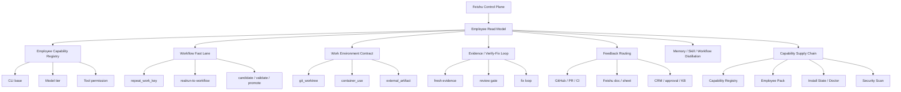

# EduFlow 升级总纲：从 AI 团队运行时到公司智能体员工操作系统

## 核心判断

EduFlow 的定位不应该是“教育智能体团队”，也不应该变成纯 coding IDE。更准确的定位是：

**公司智能体员工操作系统。**

公司通过飞书管理一组 AI 员工。每个员工有岗位身份、CLI/模型能力画像、工具权限、workflow 快速通道、隔离执行现场、证据契约、反馈 inbox 和持续沉淀机制。教育只是第一个高密度 employee pack。

二次校准：下面九个方向是中期能力地图，不是实施顺序。结合当前 EduFlow 代码和运行态，P0 应先做 `employee_read_model`、`ops-dashboard`、飞书 employee/team snapshot、runtime/task drift explainer，让已有 primitive 在飞书里变得可信和可判断。能力包、container-use、external feedback、selective install 都应排在这个状态可信层之后。详见 `05-current-eduflow-planning-recalibration.md`。

三次校准：2026-07-02 新增 `feat/2026-07-01-residency-phase1` 分支后，P0 还要先审计/吸收 `cards_v2 + resident/warm/cold + residency-sleep/wake + 主群体验收敛`。这意味着 Card Protocol v2 不再是从零 P1，而是已有底座的 hardening/adoption；Employee Read Model 和 Ops Dashboard 必须消费 `常驻 / 温备 / wake_failed / sleep_candidates`。详见 `08-residency-phase1-branch-impact-2026-07-02.md`。

外部项目分别补不同层：

| 项目 | 该学什么 | 不该学什么 |
| --- | --- | --- |
| `claude-squad` | 多 session 操盘、worktree 隔离、diff/review/pause/resume | 不要把 EduFlow 主界面变成 TUI |
| `agent-orchestrator` | durable facts、CDC/read model、PR/CI/review feedback 回流 | 不要把所有公司任务 PR 化 |
| `container-use` | container + branch 的隔离执行现场、command log、merge/apply/discard | 不要把 workflow 误认为 container |
| `oh-my-claudecode` | staged pipeline、模型分层、verify/fix loop、deep interview、HUD、skillify/handoff/critic | 不要照搬 Claude Code plugin/hook 分发模型 |
| `affaan-m/ECC` | capability registry、selective install、rules/skills/agents 治理、doctor/repair、安全扫描、continuous learning | 不要照搬“全量安装 skill 集合”，要学能力供应链 |

## 目标架构



## 九个升级方向

### 1. 飞书员工信息展示层

这是 EduFlow 的第一产品界面。不要先做 Electron，也不要让老板看 tmux 噪声。

应交付：

- Employee Status Card：员工、岗位、CLI/模型、当前任务、最近可见信号。
- Team Snapshot Card：全队状态、卡点、等待决策、异常。
- Workflow Route Card：任务命中的 workflow、当前 gate、参与员工、next_action。
- Environment Card：environment id、branch、command log、diff、service URL、merge/apply/discard。
- Evidence Card：产物、引用、测试、review verdict、closeout status。

### 2. 员工能力画像

把 runtime registry 从“容灾配置”升级成“员工能力层”。

字段建议：

```text
employee_id:
role:
department:
primary_cli:
primary_model:
model_tier: budget | balanced | premium
fallback_chain:
model_strengths:
tool_permissions:
workflow_permissions:
environment_policy:
evidence_contracts:
visible_to_feishu: true
```

借鉴 OMC 的模型分层，但 EduFlow 更有优势：它不是单 Claude Code 引擎，而是多 CLI、多 provider、多模型的公司员工系统。

### 3. workflow 快速通道

workflow 是 EduFlow 的组织复利层，不是普通 SOP。

逻辑闭环：

```text
repeat_work_key 发现重复
→ manager/worker_builder 判型
→ 单员工能力沉淀成 Skill
→ 多员工固定链路沉淀成 workflow
→ 岗位级组合沉淀成 employee pack
→ 一次性经验保留 case note
```

判型规则：

| 重复模式 | 应沉淀为 |
| --- | --- |
| 单个员工反复做同类操作 | Skill |
| 多个员工按固定链路协作 | workflow |
| 某个岗位长期复用一组技能与 workflow | employee pack |
| 一次性教训或异常样本 | case note |

近期重点不是“自动执行 workflow”，而是让 workflow 在飞书里可见、可调用、可复盘。

### 4. Work Environment Contract

借鉴 `container-use`，给高风险执行任务增加“隔离现场”。

字段建议：

```text
environment_type: shared | git_worktree | container_use | remote_sandbox | external_artifact
environment_id:
task_id:
workflow_id:
owner:
branch:
base_commit:
command_log_ref:
diff_ref:
service_urls:
secrets_policy:
merge_policy:
discard_policy:
```

适用场景：

- `worker_builder` 工程改动。
- 自动化脚本生成。
- 批量文件迁移。
- 题库工具/校验工具生成。
- 任何可能污染主工作区或安装依赖的任务。

### 5. 阶段化编排管线

借鉴 OMC 的 `team-plan → team-prd → team-exec → team-verify → team-fix`，但落到 EduFlow 的 workflow registry。

建议每个 workflow 增加：

```text
stages:
  - plan
  - exec
  - verify
  - fix
  - closeout
stage_owner:
stage_handoff:
stage_evidence_required:
max_fix_rounds:
```

不要让 manager 永远靠临场判断。workflow 应该告诉 manager 当前处于哪个阶段、谁负责、下一步是什么。

### 6. 基于证据的 verify/fix loop

EduFlow 已有 `task_publish_gate`、`task_evidence_account`、`subject_verifier`，下一步要从“发布前 gate”升级为“验证循环”。

建议：

- 增加 `evidence_freshness`：验证证据必须是新鲜输出，不接受陈旧截图或口头声称。
- 增加 `verify_fix_loop`：验证不通过时自动生成 fix task 回原 owner，最多 N 轮。
- 增加 `reviewer pre-commitment`：reviewer 先预判风险点，再审查。
- 增加 `deslop/regression`：清理 AI 味、格式、冗余后再回归验证。

### 7. 外部反馈回流

借鉴 `agent-orchestrator` 的 observer/lifecycle。

EduFlow 不应该只看 pane 和 inbox，还要把外部事实回流给原 owner：

- GitHub CI failed。
- PR review requested changes。
- 飞书文档评论。
- 表格行状态变更。
- CRM 客户回复。
- 审批驳回。
- 知识库冲突。

核心规则：

- 反馈必须带 source signature，幂等去重。
- 默认回流给原 owner。
- 只有决策/升级/正式收口才打给 manager。
- 需要 user 判断时才出现在飞书 user 可见面。

### 8. 记忆、Skill、handoff 沉淀

借鉴 OMC 的 `skillify` 与阶段 handoff，但保持 EduFlow 的可审计哲学。

建议：

- task 完成后生成 `.eduflow-team-state/handoffs/<task_id>.md`。
- handoff 标准字段：Decided / Rejected / Risks / Files / Remaining / Evidence。
- 从 good run 中自动建议 Skill candidate。

### 9. 能力目录与选择安装

这是 ECC 补给 EduFlow 最关键的一层。EduFlow 不应该只问“这个员工能不能做任务”，还要能回答：

- 这个员工装了哪些 rule、skill、workflow、MCP 和 CLI/script？
- 这些能力分别来自哪里、版本是什么、谁维护？
- 哪些能力是岗位默认，哪些是临时授权？
- 某条 workflow 依赖的能力是否齐全？
- 某个 skill 是否重复、陈旧、权限过大或来源不可信？
- 升级、修复、卸载时哪些文件是 EduFlow 拥有的？

建议新增 `Capability Registry`：

```yaml
capability_unit:
  id:
  type: rule | skill | workflow | mcp | cli_script | employee_pack
  owner:
  version:
  source:
  target_roles:
  target_cli:
  permissions:
  dependencies:
  install_profile:
  evidence_contract:
  health_status:
```

建议新增 `Employee Pack`：

```yaml
employee_pack: worker_builder.code-production
rules:
  - evidence-required
  - safe-command-boundary
skills:
  - repo-analysis
  - test-driven-development
  - realrun-to-workflow
workflows:
  - code-change-verify-fix
mcp:
  - github
  - lark-doc
environment_policy:
  default: git_worktree
  high_risk: container_use
```

建议新增 `capability-pack-doctor` 原生 skill/命令面：

```text
eduflow capability list
eduflow capability plan --role worker_builder --profile code-production
eduflow capability apply --dry-run
eduflow capability doctor
eduflow capability repair
eduflow capability security-scan
```

这会把 EduFlow 从“员工 + workflow 编排”推进到“员工能力供应链治理”。
- 从 repeated multi-agent run 中自动建议 workflow candidate。
- 从岗位长期组合中建议 employee pack。

## 30 天实施顺序

### 第 1 周：飞书 Read Model

- M0.5 residency phase1 branch review（如果分支尚未合并）
- `employee_read_model.py`
- `cards_v2` adoption/hardening，不重复造协议
- Employee Status Card
- Team Snapshot Card
- Workflow Route Card 最小版
- residency summary：常驻 / 温备 / wake_failed / sleep_candidates

验收：飞书里能看清谁在做什么、走哪个 workflow、下一步是谁；能区分温备、停止、外显陈旧但 heartbeat 新鲜、wake failure。

### 第 2 周：能力画像 + workflow read model

- employee capability profile
- model tier / CLI base / fallback chain 可见
- workflow read model
- `repeat_work_key` 到 Skill/workflow/employee-pack/case-note 的判型规则落文档

验收：manager 能判断谁适合接任务，也能判断重复工作该沉淀到哪一层。

### 第 3 周：Work Environment Contract + 阶段 handoff

- environment contract skeleton
- Environment Card
- `git_worktree` adapter 最小版
- container-use adapter 先做 proposal，不急着深集成
- `.eduflow-team-state/handoffs/<task_id>.md`

验收：工程/高风险任务有环境 ID、branch、diff、command log 或等价证据。

### 第 4 周：verify/fix loop + feedback routing

- evidence freshness
- verify/fix loop 最小版
- GitHub feedback poller 最小版
- Feishu Exception/Decision Card

验收：验证失败能自动回派；外部失败能回到原 owner；manager 不被低价值噪声打爆。

## P0 / P1 / P2

### P0

- M0.5 residency phase1 branch review。
- 飞书员工信息展示层。
- 员工能力画像。
- `cards_v2` 复用与 hardening。
- residency read model：常驻 / 温备 / wake/sleep。
- workflow 快速通道 read model。
- repeat_work_key 判型规则。

### P1

- Work Environment Contract。
- 阶段化 workflow stages。
- evidence freshness。
- verify/fix loop。
- handoff notes。

### P2

- container-use adapter。
- GitHub/PR/CI feedback routing。
- HUD / Agent Observatory。
- TUI / `eduflow squad` 后台运维界面。

## 不做或晚做

- 不先做 Electron。
- 不把飞书降级成通知口。
- 不把全部任务容器化。
- 不把所有公司任务 PR 化。
- 不照搬 OMC 的 Claude Code plugin/hook 分发模型。
- 不让 workflow 自动绕过 manager closeout。

## 最终一句话

EduFlow 下一步不是“多接几个 agent”，而是把现有多 CLI 团队升级成可运营的公司员工系统：

**飞书看得见，manager 派得准，员工能力可路由，workflow 可复用，执行现场可隔离，验证证据可追溯，外部反馈能回流，经验能沉淀。**
